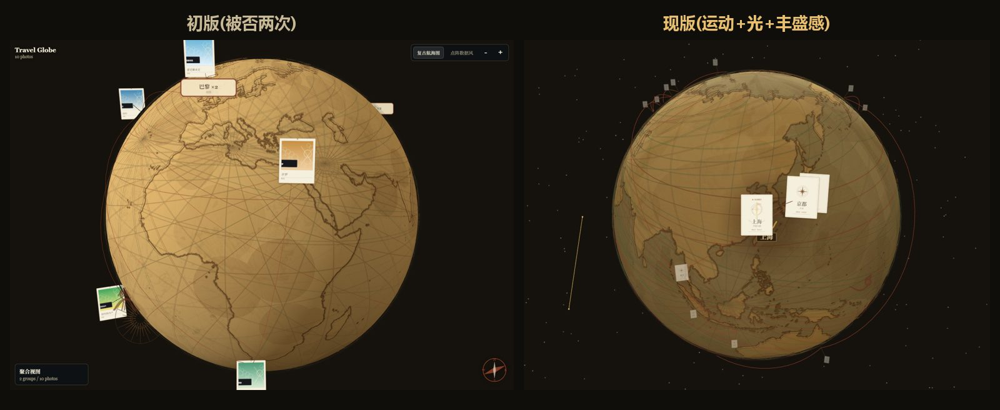

# Product Decision Log · 产品决策日志

> **TL;DR (EN):** This project pivoted twice — photo-album toy → travel-personality quiz → "your travel globe". Each pivot came from an explicit **first-principles + adversarial review** loop: derive independently, let a skeptic try to kill it, keep only what survives, and pre-commit kill criteria before building the next stage. This file records the decisions *and the arguments that lost*.

写给未来的自己和任何想复用这套方法的人：每个关键决策都记录「当时怎么想的、被什么打穿、最后为什么这么定」。**输掉的论点也保留**——它们是方法的一部分。

> 说明：本仓库以单次导入的方式发布（发布前的迭代发生在本地与 AI 协作会话中，未逐步进 git）。发布前的演进过程以本日志为准；发布后的迭代以真实提交历史为准。

---

## 决策 0：做「表演」，不做「产品」（视觉阶段）

初版地球静态截图很好看，但连续两次被否。复盘出的审美第一性原理：

> 「惊艳」= 运动编排（开场电影/镜头飞行/进场仪式）+ 光的戏剧（明暗对比/夜景灯光/大气辉光）+ 丰盛感（元素密度）。静态好看只是及格线。

由此追加：电影式开场、实时晨昏线夜景、星座连线星海、古帆船漂移。

**教训：给消费者的视觉产品，评价标准是「表演」，不是「界面」。**

## 决策 1：从相册工具 → 身份表达品

做完视觉后的产品分析结论：**视觉不是瓶颈，创建流程 + 传播闭环才是。**「旅行相册」是低频工具，用户没有理由发出去；「我的旅行版图」是身份表达——分享动机来自「我比较会玩，我的旅行经历值得被看见」。这一判断的依据是对同类刷屏产品（测试类 H5）的传播结构复盘：被分享的从来不是工具本身，而是「说了我是谁」的那张图。

## 决策 2：人格测试为主？——被对抗式审查否掉（路A→路B）

当时的方向：类 MBTI 的「旅行人格测试」（8 型人格，判定内核已建完、15/15 测试通过）。对它做第一性原理审查，三问击穿：

1. **用户为什么分享测试结果？** 因为标签让他在社交场合更有趣。而「松弛感/特种兵」是 2023 年的旧梗——没有新的情绪触发点。
2. **3D 地球对用户的真实价值？** 截图后动效消失，静图要赢过九宫格/足迹地图——「好看」不稀缺（**截图悖论**）。
3. **MVP 和真产品是同一个东西吗？** 不是。测试 MVP 验的是「标签的社交货币」，真产品卖的是「地球的社交货币」——**验证了也白验**（最致命）。

**裁决（人做的，不是 AI）：路B**——地球=核心产品，人格测试降级为皮肤/本命城市的输入。

砍掉的具体是什么要说准确：**砍掉的是「人格测试作为主产品」这个方向**（它刚建完、刚通过全部测试）；判定引擎代码降级保留，作为入口的个性化参数复用。方向作废的代价是真实的——为它写的 MVP 规划、渠道方案、验证脚本整体推翻重来。

## 决策 3：对路B自己再打一遍（多智能体对抗）

路B拍板后没有直接开工，而是让 4 个独立视角（真MVP/资产去留/分享回路/护城河变现）各自从第一性原理推导，再各配一个 skeptic 攻击求伪，只综合存活结论（9 个 agent，约 65 万 token）。被打出来的关键事实：

- **无照片的城市在球上是隐形的**（pin 初始透明，等照片 onload 才显形）——「选城市→看到地球」这条路在代码层根本不通。修复它（运行时 canvas 铭牌钉）成为第一优先。
- 入口到地球的数据桥完全不存在，不是「接线」是「从零搭」。
- 精密的人格判定引擎对「选个皮肤」是过度设计——保留但降级，别让存量复杂度绑架节奏。
- 收入预期必须三重打折联合估算（可触达人群 × 付费率 × SKU转化），比单看付费率的直觉小一个量级。

发布前又跑了一轮四镜头对抗审查（招聘官/产品面试官/工程师/内容运营，26 个 agent、约 132 万 token），产出 22 条确认问题（含 2 条 XSS/数据劫持级代码缺陷、多条文案与事实不符），全部修复后才发布——本文件当前版本就是那次审查的产物之一。

## Kill Criteria（在动工路B之前预设）

这些标准写于路B工程开工前（对抗工作流的综合产出），目的是防止做完之后为沉没成本辩护：

| # | 信号 | 结论 |
|---|---|---|
| 1 | 看到自己地球的人，导出率 < 35% | 地球不是社交货币，回炉审美，不铺量 |
| 2 | 导出率高但定性追踪几乎没人真发出去 | 指标假阳性 |
| 3 | 动图发出去无人问「这哪做的」 | 差异化「那一眼」不成立 |
| 4 | 7 天回访再导出 < 15% | 「更新→再发」循环输给旅行低频的品类物理，转一次性裂变 |
| 5 | 去过 <8 城的用户被「空球」劝退 | 可用人群大幅收窄 |
| 6 | 用户不接受 localStorage 单机存储的丢失风险 | 留存承诺的隐藏命门 |

**阈值取法**：导出是一次点击的零成本动作，若连三分之一的人都不愿带走，说明「想晒」不成立（35%）；旅行是季度级低频行为，7 天窗口内的回访本来就是乐观上限，低于 15% 说明循环只存在于设想里。这些是预注册的判断线，不是行业基准——它们的作用是逼自己在数据面前认输，而不是精确预测。

**测量方式（与「无后端无埋点」架构如何相容）**：MVP 阶段不上埋点。指标 1/2 用 50-100 人的内测群人工测量（发链接→回收「保存了没/发了没」的截图与自述）；指标 3 用内容平台的公开数据（评论区）；指标 4 用一周后的群内二次触达。牺牲精度换隐私承诺与零后端成本，样本量足够回答「是/否」级的问题。

## Status（2026-07）

**Pre-launch。** 工程闭环（选城→生成→导出）已完成并通过端到端验证；kill criteria 尚无真实数据——首批分发计划：① 50-100 人微信内测群（测指标 1/2/6）；② 录屏素材投抖音/小红书（测指标 3）；③ 一周后群内回访（测指标 4）。任何一条 kill criteria 触发，按表内预设结论执行,不辩护。

## 方法论沉淀

1. **对抗式双轨**：执行者与评审者分开（早期：两个不同的 AI 系统互审；后期：多智能体工作流，skeptic 显式扮演证伪者），**人只裁决方向级分歧**。本项目中人推翻/纠正 AI 的实例：路A/路B 的最终裁决；「带码海报是朋友圈唯一通道」被否（改为系统分享+存图双通道）；把确定性规则引擎误称为「AI 能力」的措辞被纠正。
2. **第一性原理三问**：用户到底在买什么？我的差异化对「用户」值钱还是只对「我」值钱？MVP 验的假设和产品卖的东西是不是同一个？
3. **先立 kill criteria 再动工**：防止做完之后为沉没成本辩护。
4. **验证纪律**：修复前先实测复现；结构性修复焊进构建工具而不是手改产物；headless 环境的渲染验证走强制单帧+像素采样，不迷信截图。
