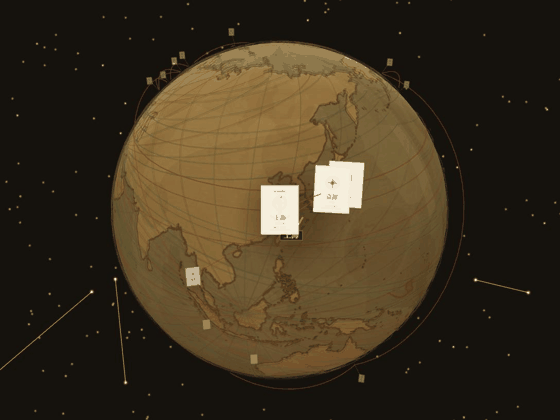

# 🌍 Travel Globe — your journeys, pinned on a hand-drawn world

[](https://github.com/nieears-cell/travel-globe/actions/workflows/ci.yml)

Pick the cities you've been to. Get a **vintage nautical-chart globe** with your personal route, a home-port anchor, and a shareable 1080×1920 travel card — computed and rendered entirely in your browser.

**No account. No backend. No tracking. One HTML file.**

### ▶ [Try it live](https://nieears-cell.github.io/travel-globe/) · [Create your own globe](https://nieears-cell.github.io/travel-globe/create.html)

<p align="center">
  
</p>

| | |
|---|---|
| 🗺 **Live demo** | [nieears-cell.github.io/travel-globe](https://nieears-cell.github.io/travel-globe/) — curated world-cities showcase |
| ✏️ **Create yours** | [create.html](https://nieears-cell.github.io/travel-globe/create.html) — pick cities → globe in ~30 seconds |
| 📷 **Photo-album mode** | [album.html](https://nieears-cell.github.io/travel-globe/album.html) — photos with EXIF GPS pinned to the globe (placeholder art) |
| 📓 **Product decision log** | [DECISIONS.md](DECISIONS.md) — two pivots, adversarial reviews, pre-committed kill criteria |

---

## Features

- **Vintage nautical chart** — parchment world map generated at build time from Natural Earth coastlines (etched-copper style), a procedural star field with constellation-style linework, a sailing ship drifting along your route, and a home-port anchor mark.
- **Realistic night mode** — NASA Black Marble texture with a **live day/night terminator**: the subsolar point is computed from real UTC time and injected into the material via a custom shader chunk (`onBeforeCompile`), so city lights only shine on the night side — right now.
- **City nameplate pins** — drawn on canvas at runtime (compass-rose emblem, city name, coordinates, ★ home-city badge). No photos required; the globe works from a plain list of city names.
- **Share-card export** — one tap renders a 1080×1920 portrait card: your globe, city/country counts, and total mileage (great-circle sum over your route).
- **Cinematic intro & tour mode** — `?tour=1` auto-cruises between your cities; `&switch=1` adds a mid-flight theme dissolve, `&dwell=2500` tightens the pacing for short-form video. Made for screen recording, portrait-aware.
- **Single-file build** — Three.js, both map textures, coastline geometry and city data are inlined into one HTML file. Open it from disk, email it, host it anywhere. Works offline.
- **Privacy by construction** — your city list lives in `localStorage` and URL params. Nothing leaves the browser.

## Quick start

```bash
# just open the built site in any browser
docs/index.html                 # your globe (or a showcase if you haven't made one)
docs/create.html                # pick cities, then generate

# rebuild from source (Python 3.10+, Pillow)
pip install pillow
python build_globe.py           # → Travel_Globe.html + docs/{index,album}.html

# rebuild with your own photos (EXIF GPS or locations.csv)
python build_globe.py /path/to/photos

# run the test suite (same gates as CI)
node persona-core/test_golden.js
node persona-core/sim_distribution.js
```

## Architecture

```
build time (Python + Pillow)                      runtime (vanilla JS + Three.js r158)
──────────────────────────────                    ─────────────────────────────────────
Natural Earth shapefiles ─┐                       ?cities=A,B,C ─┐
Maggiolo 1547 parchment ──┤ procedural            localStorage ──┼─→ city name → lat/lon
NASA Black Marble ────────┤ textures              fallback ──────┘   (159-city offline index)
city dataset (159) ───────┤                             │
photos + EXIF GPS ────────┘                             ▼
        │                                         nameplate pins (canvas textures)
        ▼                                         routes · clusters · home port
single-file HTML  ←── everything inlined          live terminator shader (night)
(docs/index.html ≈ 2.5 MB, no photo payload)      1080×1920 card export (canvas)
```

**Why a single file?** Distribution is the product here: the globe must open instantly from a chat message, a QR code, or a `file://` double-click — on phones, in in-app browsers, offline. One inlined file removes CDN, CORS, cache and path failures at the cost of payload size, which the build keeps in check (the landing build strips photo payload and unused theme data).

**Two-layer design.** A Python build stage does everything expensive and deterministic (texture synthesis, shapefile parsing, image encoding); the runtime stays dependency-free and data-driven (`?cities=` → pins). The same template serves three artifacts: the lite landing globe, the photo-album demo, and a legacy local build.

## Engineering notes

- **Live terminator**: sun direction derived from UTC → day-of-year declination + hour angle; fragment shader masks Black Marble city lights to the night hemisphere with a soft dawn/dusk band.
- **Runtime pins without images**: nameplates are canvas-drawn `CanvasTexture`s, so a globe renders synchronously from bare city names — no `Image().onload` dependency (which previously made photo-less pins invisible).
- **Mileage**: haversine great-circle distance summed over home-port → city route order.
- **Deterministic rules engine** (`persona-core/`): a ratio-based scorer with priority tie-breaking maps city sets + 3 answers to 8 traveler archetypes. CI enforces 15 golden test cases **and** a 20,000-run Monte-Carlo distribution gate (every archetype ≥5%, fixed seed).
- **Verification hooks for headless environments**: the page exposes `window.TravelGlobeTest` (pin states, forced single-frame render, export probe) so rendering can be verified even where `requestAnimationFrame` is suspended.

## 中文说明

**旅行地球**：勾选你去过的城市，生成一个专属的复古航海图 3D 地球——你的航线、母港之锚、★本命城市，一键导出 1080×1920 竖屏「旅行身份卡」。无账号、无后端、数据不出浏览器；单文件 HTML，断网可用。

- 在线体验：[主页](https://nieears-cell.github.io/travel-globe/) / [创建你的地球](https://nieears-cell.github.io/travel-globe/create.html)
- 录屏模式：任意地球页加 `?tour=1`（自动巡航），`&switch=1` 中途溶解切换主题，`&dwell=2500` 加快节奏
- 重建：`pip install pillow && python build_globe.py`
- 产品决策全记录（两次转向、对抗式审查、kill criteria）：见 [DECISIONS.md](DECISIONS.md)

## Credits

- Coastline & land geometry: [Natural Earth](https://www.naturalearthdata.com/) (public domain)
- Night lights: [NASA Black Marble 2012](https://earthobservatory.nasa.gov/features/NightLights) (public domain)
- Parchment base: Vesconte Maggiolo portolan chart, 1547 (public-domain artwork)
- Renderer: [Three.js](https://threejs.org/) r158 (MIT)

## License

[MIT](LICENSE) — code. Demo "photos" are procedurally generated placeholders; the textures above keep their original public-domain status.
